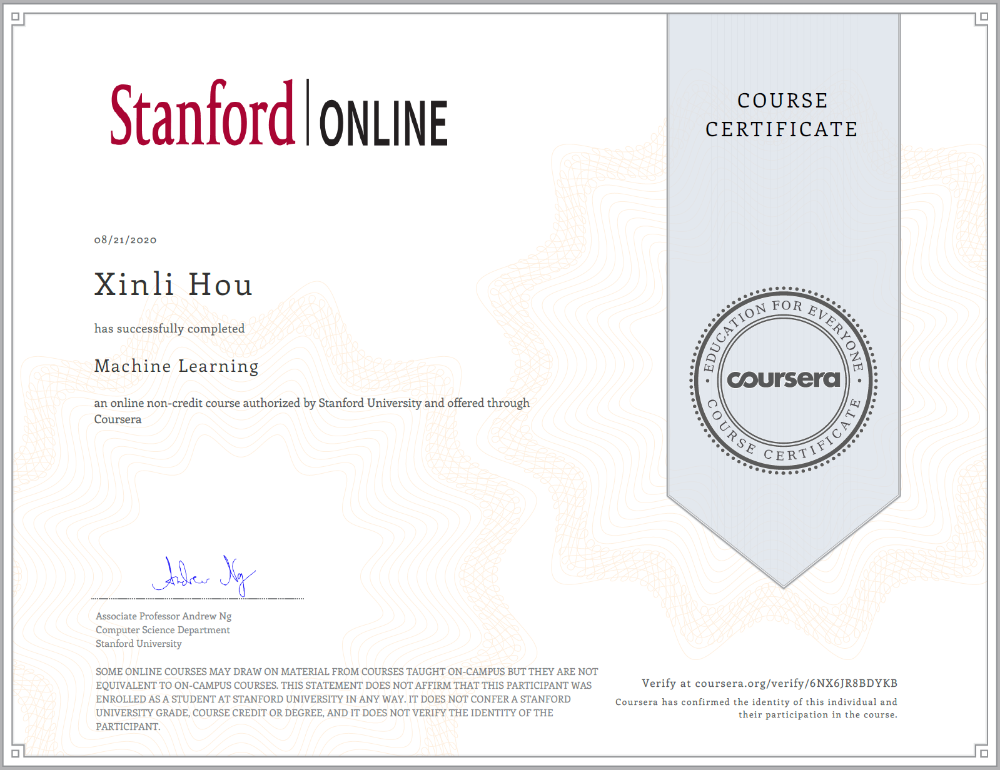

# Machine Learning--Stanford Online Course

**--taught by Andrew Ng** 

This course provides a broad introduction to machine learning, datamining, and statistical pattern recognition. Topics include: 

* Supervised learning (parametric/non-parametric algorithms, support vector machines, kernels, neural networks). 

* Unsupervised learning (clustering, dimensionality reduction, recommender systems, deep learning). 

* Best practices in machine learning (bias/variance theory; innovation process in machine learning and AI). 

You can learn it on [Coursera](https://www.coursera.org/learn/machine-learning) and earn a  upon completion. Or you can watch lecture videos on [bilibili](https://www.bilibili.com/video/BV164411b7dx?from=search&seid=2447822532562598581) and here are [Lecture Slides](Lecture Slides).

This course includes [Programming Exercises](Programming Exercises) designed to help you understand how to implement the learning algorithms in practice. To complete the programming assignments, you will need to use [Octave](https://www.gnu.org/software/octave/) or MATLAB. I used Octave. The Octave syntax is largely compatible with MATLAB and it's free.

